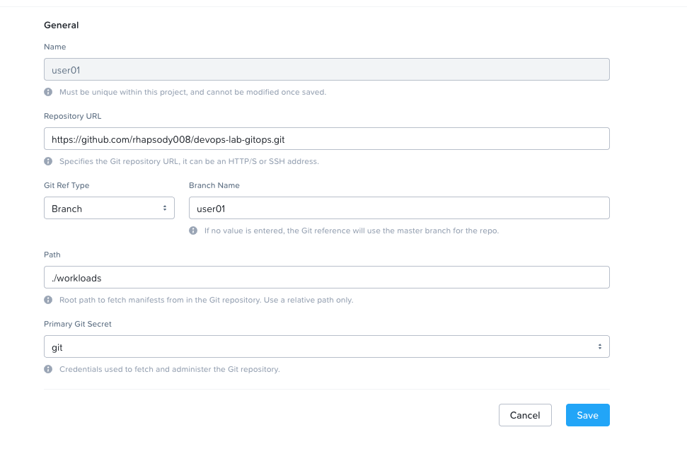

# DevOps POC

## User Experience

1. Check the web page, k8s dashboard to see existing running app
2. Setup the repository  
```
git clone git@github.com:rhapsody008/devops-lab-dev.git
git checkout user01
```
2. make changes to server.js 
3. commit changes
```
(Optional) git status / git diff
git add server.js
git commit -m "Updates for User01"
git push origin user01
```
4. Wait and see the changes reflected on web page e.g. [sample web app](https://10.54.93.221/user01)
5. Showcase NKP logging & monitoring capabilities: Explore k8s Dashboard for deployment/pod status & Loki Explore on logs collection

## Workflow Explained

### Diagram


### CI - Docker Image Build
1. A simple NodeJS app with Dockerfile present, with message printed & displayed on web server from [server.js](./server.js)

2. After a change made to the message, users should push to the branch that has the unique username (e.g. branch "user01")

3. Upon push received, GitHub Actions Worklow is triggered to start a runner and build the Docker image from Dockerfile. The runner then push the image to the registry.

4. After image was pushed to registry, the runner will update the [GitOps](https://github.com/rhapsody008/devops-lab-gitops) repo with a newly generated Kustomization file, containing new image tag, on the same branch name.

### CD - Deploy to NKP
1. NKP Management cluster, a project is created with CD configured to track the GitOps repo on respective branches for different users.
2. Upon branch commit received, Flux CD in Management cluster will trigger a new deployment to the NKP workload cluster with the updated image tag

3. After deployment completed (usually up to 3 minutes), the web page is updated with the change.

## To Do

1. Git Credentials - SSH? to be injected
2. Workload/Performance, runner environment - to be settled

## Reference

- NKP mgmt cluster CD configuration example: 



