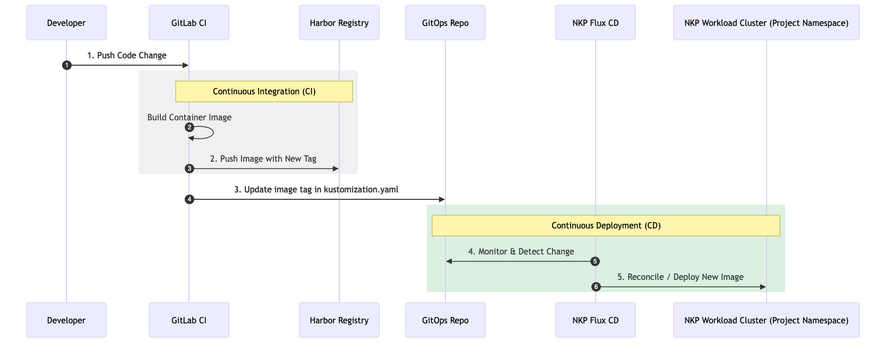

# User Experience

## CI/CD Workflow

1. CI trigger: Code push from Gitlab webapp-user## on any code change
2. CI: Gitlab CI to trigger Gitlab Runner to build the image and push to Harbor
3. CI: Gitlab CI to update the image tag to gitops-user## repo kustomization.yaml file
4. CD: NKP Flux CD monitors gitops-user## repo. Once the change was made, NKP automates the deployment of new container image into the workload k8s cluster and project namespace.



## Steps On Web IDE
1. Clone Git repository & checkout code
```
git clone https://yzlabntnx@gitlab.com/devops-lab5952301/webapp-user01.git
cd webapp-user01
git checkout origin/main
```
*!! Might need to input password*

2. Make code changes in main.go

```
func handler(w http.ResponseWriter, r *http.Request) {
	// ------** Change made here **------
	fmt.Fprintf(w, "Hello from Nutanix! this is the updated version.")
	// ---------------------------------
}
```

3. Commit & Push Code

Check & add after changes are made:
```
git status
git add main.go
```

Commit & push changes:
```
git commit -m "Modify print message"
git push origin HEAD:main
```

## Observations

1. GitLab CI Running Status
   
2. (Optionally demo) Harbor Registry to check image present
3. NKP Kommander Dashboard - Review CD source
4. (Optionally Demo) k8s Dashboard - deployment/pod running status
5. Get ingress IP from CLI/Dashboard
6. See updated print message on https://*<Ingress_IP>*/user01